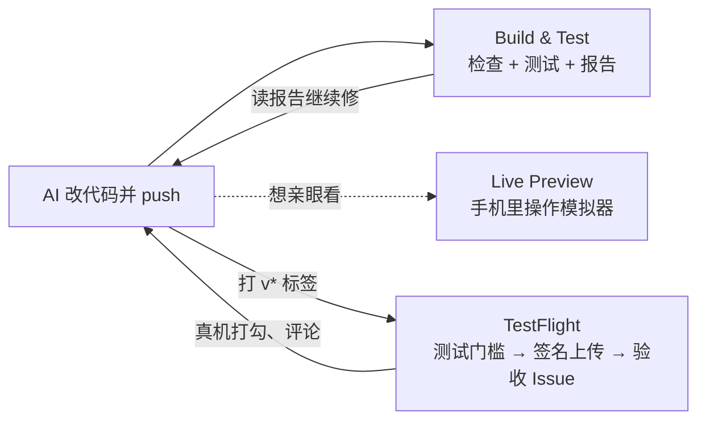

# ios-ci-workflows

**一台手机 + AI + GitHub Actions 开发 iOS App 的中央工作流仓库。**

> 对你的 AI 说：**“按 ios-ci-workflows 的 Skill 接入这个项目。”**
> 它会读 [`skills/ios-ci-workflows/SKILL.md`](skills/ios-ci-workflows/SKILL.md)，替你写好配置文件和入口文件。

```mermaid
flowchart LR
  A[AI 改代码并 push] --> B[Build & Test<br/>检查 + 测试 + 报告]
  B -->|读报告继续修| A
  A -.想亲眼看.-> L[Live Preview<br/>手机里操作模拟器]
  A -->|打 v* 标签| T[TestFlight<br/>测试门槛 → 签名上传 → 验收 Issue]
  T -->|真机打勾、评论| A
```

你不部署任何东西，也不是在调用我们的服务：入口文件 `uses:` 指向本仓库某个版本，GitHub 把工作流拉到你自己的仓库里执行，用你的 runner 分钟数，Secrets 只在你的运行里使用。

## 快速开始

每一级都能单独用，从等级 1 开始：

| 等级 | 接入 | 需要的 Secrets | 复制这些文件（在 [`templates/`](templates/)） |
| --- | --- | --- | --- |
| 1 | Build & Test | 0 个 | `.ios-ci.yml`、`.github/workflows/build-test.yml` |
| 2 | + TestFlight | 4 个（Apple） | `.github/workflows/testflight.yml`、`.github/release-checklist.md` |
| 3 | + Live Preview | 1 个（预览密码） | `.github/workflows/live-preview.yml` |
| 4 | + App Icon / 后端 | 按需 | `.github/workflows/app-icon.yml`；后端见 [CloudBase](docs/cloudbase.md) |

1. 把 `.ios-ci.yml` 里的工程名、scheme、Bundle ID 改成你的。
2. 入口文件里的 `<SHA>` 换成本仓库某个 Release 的提交，如 `@<SHA> # v1.0.0`。
3. push，在 Actions 里看 **Build & Test** 的测试报告。

再把 [`templates/AGENTS.md`](templates/AGENTS.md) 放到 App 仓库根目录，AI 每次都会读到最关键的几条规则。

**适用范围**：iOS App、单个主 scheme、Xcode 26、XcodeGen 生成或已提交 `.xcodeproj`。不覆盖 macOS / watchOS 目标，也不支持一个仓库里放多个 App。

## 文档

| | |
| --- | --- |
| [配置文件 `.ios-ci.yml`](docs/config.md) | 所有键和默认值 |
| [工作流参考](docs/workflows.md) | 每条工作流做什么、测试分层、通过/失败规则、产物、权限、完整流程图 |
| [Secrets 与 Variables](docs/secrets.md) | 总表，以及 Apple API Key 怎么生成 |
| [Live Preview](docs/live-preview.md) | 串流链路、固定域名、局限 |
| [CloudBase 后端](docs/cloudbase.md) | 测试/生产环境、CLI 部署、MCP 网关 |
| [版本与升级](docs/versioning.md) | 怎么引用、怎么升级、外部依赖 |
| [安全约定](docs/security.md) | |
| [常见问题](docs/faq.md) | |
| [致谢与第三方许可](docs/credits.md) | |

MIT License
