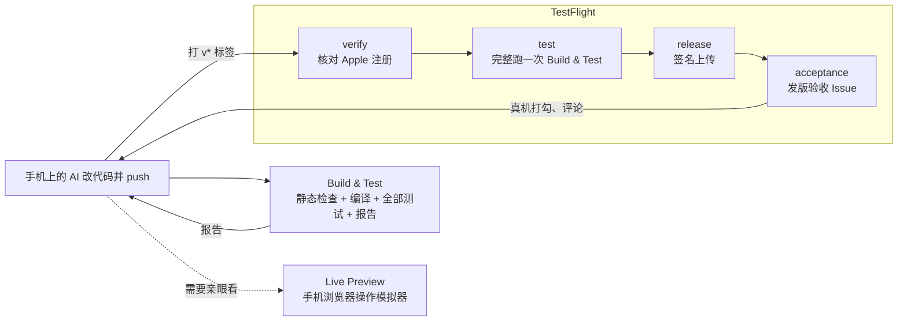

# 工作流参考

工作流按“什么时候触发、要不要密钥、跑多久”划分：

| 工作流 | 触发 | 密钥 | Runner | 性质 |
| --- | --- | --- | --- | --- |
| [Build & Test](#build--testbuild-testyml)（`build-test.yml`） | 每次 push / PR | 无 | Linux + macOS 并行 | 自动，必须快、必须稳 |
| [Live Preview](#live-previewlive-previewyml)（`live-preview.yml`） | 仅手动 | 预览密码 | macOS | 交互式，最长 20 分钟 |
| [TestFlight](#testflighttestflight-releaseyml)（`testflight-release.yml`） | 手动或 `v*` 标签 | Apple 4 项 | Ubuntu + macOS | 发布，不可撤回 |
| [App Icon](#app-iconapp-iconyml)（`app-icon.yml`） | 图标素材改动 | 无 | macOS | 自动，几分钟 |
| CloudBase 部署（`cloudbase-deploy.yml`） | 云函数改动 / 手动 / 标签 | CloudBase API Key | Ubuntu | 可选，见 [cloudbase.md](cloudbase.md) |
| MCP 网关部署（`cloudbase-mcp-gateway-deploy.yml`） | 手动 | Cloudflare + 网关 3 项 | Ubuntu | 可选，长期计划移出本仓库 |

`cloudbase-mcp-gateway.yml` 是本仓库改网关代码时的自检，不给使用者调用。

App 的设置都在 App 仓库的 [`.ios-ci.yml`](config.md)。每条 iOS 工作流先跑一个 `config` job 读取它，再用 GitHub 提供的 `job.workflow_repository` / `job.workflow_sha` 从**同一个仓库、同一个提交**拉取 `scripts/`：入口文件只写一次 `@<SHA>`，fork 的人自动用自己 fork 里的脚本。



---

## Build & Test（`build-test.yml`）

CI 是测试的唯一入口，只做“自动检查”一件事：每次 push 和 PR 都把全部测试从头跑一遍，输出一份人和 AI 都能直接读的测试报告。测试以苹果官方工具为地基，第三方只补苹果没有的部分；AI 看截图做 UI 自检不可靠，只作补充。

### 测试分层（测试写在 App 仓库，这里负责跑和汇报）

| 层 | 工具 | 负责抓什么 |
| --- | --- | --- |
| 逻辑测试（最多） | Swift Testing / XCTest | 业务规则、日期边界、数据存取；参数化测试一次喂几十组数据 |
| 时间控制 | [swift-dependencies](https://github.com/pointfreeco/swift-dependencies) | 把“今天”固定成春节、闰月、跨年等边界日期 |
| 迁移测试 | Swift Testing + 历史版本数据文件 | 升级后旧数据能否正确读取（每发一个正式版就存一份样例数据） |
| 快照测试（视觉回归主力） | [swift-snapshot-testing](https://github.com/pointfreeco/swift-snapshot-testing) | 文字截断、元素重叠、布局错位；逐像素对比参考图 |
| 关键流程（只写 3～5 条） | XCUITest | 核心用户路径 |
| 无障碍审计 | `performAccessibilityAudit()`（在 XCUITest 里调用，测试名带 Accessibility） | 文字截断、对比度不足、点击区域太小、缺标签 |
| 多环境组合 | Test Plan（`.xctestplan`） | 浅色/深色、中/英文、大字号，同一套测试跑多种配置 |
| 静态检查 | SwiftLint、SwiftFormat（Linux） | 代码规范、格式 |

App 仓库的推荐布局：

```
MyAppTests/          逻辑测试、迁移测试（历史版本数据放 Fixtures/）
MyAppSnapshotTests/  快照测试 + __Snapshots__ 参考图
MyAppUITests/        关键流程 + 无障碍审计
MyApp.xctestplan     测试计划（可选）
```

### 三个并行 job

- **static-checks**（`ubuntu-latest`，不耗 macOS 分钟）：仓库根或 `workdir` 里有 `.swiftlint.yml` 就跑 SwiftLint，有 `.swiftformat` 就跑 `swiftformat --lint`，问题标在 PR 的代码行上；都没有就跳过。
- **test**（`macos-26`）：
  1. 按 `toolchain` 选 Xcode、生成工程（缓存 Swift Packages），启动固定的模拟器；找不到就失败并列出 runner 上有的。
  2. `xcodebuild test`（不签名）跑 scheme 或 `test_plan`，日志经 xcbeautify 整理，原始日志另存 `xcodebuild.log`。测试失败不会中断后面的步骤。
  3. 安装并启动 App，校验 Bundle ID，截图 `launch.png`，导出 App 日志；用 XcodeBuildMCP 抓无障碍 UI 树 `ui-tree.json`（AI 写测试时的“界面地图”）。
  4. `scripts/xcresult-report.py` 读 `Test.xcresult` 写测试报告：结论、失败的测试和原因、快照不一致（附 reference / failure / difference 图）、无障碍问题、新录制的快照。写进 job summary 和 `report/report.md`、`report/report.json`。
  5. 按下表判定通过或失败。
- **commit-snapshots**（可选）：见下面的“快照录制”。

### 通过 / 失败

| 情况 | 结果 |
| --- | --- |
| 编译失败 | 失败，报告列出 `error:` 行 |
| 逻辑、迁移测试或关键流程失败 | 失败 |
| 快照不一致 | 失败；录制模式下不算 |
| 无障碍审计失败 | `accessibility_audit: warn` 时只警告；问题清干净后改成 `fail` |
| `xcodebuild` 非零退出但报告里没有失败（测试进程崩溃等） | 失败 |

报告开头的“结论”按这张表写（通过 / 未通过 / 通过（N 个无障碍警告）），旁边附 xcresult 自己的 Passed/Failed。

### 快照录制

有意改了界面时，在工作分支上手动运行 Build & Test 并勾选 `record_snapshots`。CI 以 `SNAPSHOT_TESTING_RECORD=failed` 运行，只重录不一致的快照，新参考图打包为产物 `recorded-snapshots-<run>`。

`build_test.commit_recorded_snapshots: true` 时，CI 把它们直接提交回这个分支，AI 不用下载产物（很多 AI 环境下载不了 GitHub 产物）；同一轮里别的测试失败也照样提交。用任务令牌推送的提交不会触发新运行，提交后再手动跑一次 Build & Test 确认变绿。快照对系统版本很敏感，参考图只在 CI 上生成。

### 运行时开关与产物

| 入口文件 `with:` | 默认 | 说明 |
| --- | --- | --- |
| `record_snapshots` | `false` | 重新录制快照（手动运行时） |
| `config` | `.ios-ci.yml` | 配置文件路径 |

| 产物 | 保留 | 内容 |
| --- | --- | --- |
| `build-test-<run>` | 7 天 | `report/`（报告 + 失败附件）、`Test.xcresult`、`launch.png`、`ui-tree.json`、`app.log`、`xcodebuild.log` |
| `recorded-snapshots-<run>` | 14 天 | 新录制的快照参考图（有才上传） |

---

## Live Preview（`live-preview.yml`）

不是测试，而是省掉 TestFlight 这一趟：几分钟内在手机浏览器里看到并操作模拟器，用于调 UI、亲手复现 bug、演示。它和测试拆开：想看画面时直接开，不用等测试跑完；预览密码只注入这一条工作流。

流程：读配置 → 编译 App（不跑测试）→ 装进固定的模拟器并启动 → `serve-sim`（画面 + 触控，只监听本机）→ `preview-proxy.cjs` 密码网关（只转发画面和 HID 触控，屏蔽带 shell 能力的接口）→ `cloudflared` 隧道 → 手机浏览器。地址写在运行中的 job 日志和 summary 里，到时自动关闭。

| 入口文件 `with:` | 默认 | 说明 |
| --- | --- | --- |
| `preview_minutes` | `12` | 预览时长，1–20 分钟 |
| `public_preview_url` | `''` | 固定域名；空则用仓库变量 `AGENT_PREVIEW_URL`，再没有就用随机的 Quick Tunnel |
| `config` | `.ios-ci.yml` | 配置文件路径 |

Secrets：`AGENT_PREVIEW_PASSWORD`（必填，≥12 位）、`AGENT_PREVIEW_TUNNEL_TOKEN`（仅固定域名）。隧道、固定域名和局限见 [live-preview.md](live-preview.md)。

---

## TestFlight（`testflight-release.yml`）

发出去的一定是测过的。只在手动触发或推送 `v*` 标签时运行。

1. **verify**（Ubuntu）：用 `scripts/asc-verify.py` 通过 App Store Connect API 核对 Bundle ID 已注册、App 已创建；设置了 `icloud_container` 时读出 App ID 实际勾选的容器，供 `icloud-verified` 判断。`dry_run` 时跳过。
2. **test**：把 Build & Test 完整跑一次作为门槛，全部通过才进入签名。发版频率低，多跑的这几分钟值得。
3. **release**（macOS）：生成工程（注入 `DEVELOPMENT_TEAM`）→ 版本号（build number 默认 `GITHUB_RUN_NUMBER`，可指定 `marketing_version`）→ 不签名 archive 并校验图标、Bundle ID、显示名 → 按 `entitlement_mode` 嵌入权限 → `-exportArchive` + API Key 自动签名（云端管理证书）并上传 → 上传 dSYM → 无论成败删除 runner 上的 API Key。
4. **acceptance**（可选，`testflight.acceptance_issue: true`）：上传成功后开“<App> <版本> (<build>) 发版验收”Issue，内容是带勾选框的真机清单：固定项来自 `acceptance_checklist`，本次项来自 `acceptance_extra`。测试员在手机 GitHub App 里打勾、评论、配截图，AI 下次读它修问题。

| 入口文件 `with:` | 默认 | 说明 |
| --- | --- | --- |
| `lookup_only` | `false` | 只列出团队下全部 Bundle ID 与 App（名称、SKU、能力、iCloud 容器），不打包 |
| `dry_run` | `false` | 跑测试门槛并打包，但不签名不上传 |
| `marketing_version` | `''` | 版本号，如 `1.2` / `1.2.3` |
| `build_number` | `''` | 自定义 build number（纯数字） |
| `config` | `.ios-ci.yml` | 配置文件路径 |

Secrets（全部必填）：`APPLE_TEAM_ID`、`APP_STORE_CONNECT_KEY_ID`、`APP_STORE_CONNECT_ISSUER_ID`、`APP_STORE_CONNECT_PRIVATE_KEY`（`.p8` 全文）。不需要手动导出 `.p12` 证书或描述文件。怎么生成见 [secrets.md](secrets.md)。

只属于 TestFlight 的：版本号、Apple 注册核对、权限嵌入、签名上传、dSYM、验收 Issue。迁移测试放在 Build & Test 里每次都跑，不等到发版。

---

## App Icon（`app-icon.yml`）

App 仓库只保留 SVG 图层素材，由 CI 生成 Liquid Glass 的 `.icon` 图标包，确认它真的编进了 App，并输出预览图。只在图标素材改动时触发；发版时 TestFlight 也会校验图标。

- **native-validation**：同步图标 → 生成工程 → 不签名 `xcodebuild archive`，确认 `Assets.car` 和 `AppIcon*.png` 编进了 App；构建日志出现图标冲突或报错即失败。
- **preview**（失败不阻塞）：用 `icon-composer-mcp` 渲染同一个图标在 6 种外观下的预览（Default、Dark、TintedLight、TintedDark、ClearLight、ClearDark，对应 iOS 26 主屏幕的图标显示模式）+ 1 张 1024 市场图，共 7 个 PNG，上传为产物 `app-icon-<sha>`。这些只是预览，真正编进 App 的是 `.icon` 图标包。
- **publish-previews**（可选，`app_icon.commit_previews: true`）：推送到分支时把 7 张图写进 `previews_dir`，并生成图片表格 `README.md`，在 GitHub 上打开目录就能看。

入口文件没有运行时开关；`icon_path` 在配置文件里必填。

---

## 权限

必需的 job 都固定 `contents: read`。会写仓库或开 Issue 的 job（提交快照参考图、提交图标预览、开验收 Issue）不声明权限，继承入口文件给的令牌：不开这些功能的 App 不用多给任何权限；开了但权限不够时会报出缺哪一项。

| 功能 | 入口文件要给 |
| --- | --- |
| `build_test.commit_recorded_snapshots` | `contents: write` |
| `app_icon.commit_previews` | `contents: write` |
| `testflight.acceptance_issue` | `issues: write` |
